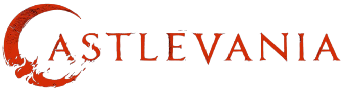

### Hi there, I'm Tatyana 👋

<!--

**tparks18/tparks18** is a ✨ _special_ ✨ repository because its `README.md` (this file) appears on your GitHub profile.
-->
<!--
- 🔭 I’m currently working on building a website and a missing-persons database for a grassroots organization called Son Irremplazables
- 🌱 I’m currently learning Wordpress
- 👯 I’m looking to collaborate on anything Javascript and Python!
- 💬 Ask me about myself
- 📫 How to reach me: LinkedIn
- 😄 Pronouns: She/Her
- ⚡ Fun fact: I am an avid reader 📚
-->

-  I’m currently working on building an open-source missing-persons database for a grassroots organization called Son Irremplazables
-  I’m currently learning Wordpress
-  I’m looking to collaborate on anything Javascript and Python!
-  How to reach me: LinkedIn
-  Fun Fact: I love 
<!--Fun fact: I am an avid reader 📚
-  Ask me about
-  Pronouns: She/Her
-->

Find me on 

### Visit my <a href="https://www.tatyanaparks.com">website/portfolio</a>

### Languages I Love:

 

### Enjoyable Frameworks and Libraries:

### Tools:

  
 

### Auth:

### Currently learning:

<!---->

